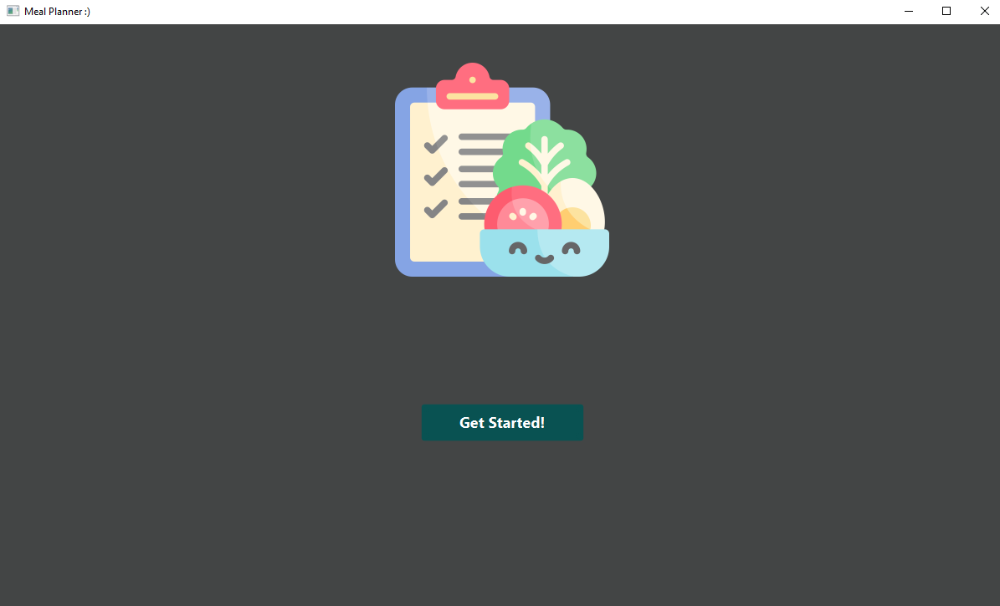

# Meal Planner

Eine Desktop-Anwendung zur Planung und Verwaltung von Mahlzeiten mit automatischem Nährwert-Tracking (Kalorien, Proteine, Kohlenhydrate, Fette).  
Entwickelt als universitäres Projekt im Informatikstudium an der Frankfurt University of Applied Sciences (2023).

  
  

## Features

- Erstellen, Bearbeiten und Löschen von Zutaten und Mahlzeiten
- Automatische Berechnung von Kalorien und Makronährstoffen
- Tages- und Wochenübersicht der Nährwerte
- Persistente Speicherung in MySQL-Datenbank
- Benutzerfreundliche GUI mit Java Swing

## Technologien

- Java (JDK 17)
- Swing (GUI)
- MySQL + JDBC

## Voraussetzungen

- Java 17 oder höher
- MySQL Server (lokal installiert)
- MySQL Workbench (optional, zum Anlegen der DB)

## Installation & Start

1. **Repository klonen**
   ```bash
   git clone https://github.com/eliasmhmd/Meal-Planner.git
   cd Meal-Planner
## MySQL-Datenbank einrichten
- Starte deinen MySQL-Server (z. B. über MySQL Workbench, XAMPP oder Kommandozeile).
- Erstelle eine neue Datenbank:
```SQL
CREATE DATABASE meal_planner CHARACTER SET utf8mb4 COLLATE utf8mb4_unicode_ci;
```
Optional: Erstelle einen dedizierten Benutzer:
```SQL
CREATE USER 'mealuser'@'localhost' IDENTIFIED BY 'dein_sicheres_passwort';
GRANT ALL PRIVILEGES ON meal_planner.* TO 'mealuser'@'localhost';
FLUSH PRIVILEGES;
```
## Datenbank-Verbindung konfigurieren
- Öffne die Datei ```src/main/java/com/example/mealplanner/DatabaseConnection.java``` und passe die Zugangsdaten an:
```Java
String databaseName = "meal_planner";
String databaseUser = "root";  // oder 'mealuser'
String databasePassword = "dein_sicheres_passwort";
String url = "jdbc:mysql://localhost/" + databaseName;
```
- Hinweis: Passe bei Zeitzonen-Problemen den URL-Parameter an (z. B. ?serverTimezone=UTC hinzufügen).
## Projekt bauen
- Mit dem enthaltenen Maven Wrapper (keine globale Maven-Installation nötig):
```Bash
./mvnw clean install
```
Oder mit installiertem Maven:
```Bash
mvn clean install
```
Anwendung starten
```Bash
./mvnw exec:java -Dexec.mainClass="com.example.mealplanner.Main"
```
- (Passe den Package-Namen an, falls dein Main anders liegt.)
- Erwartetes Ergebnis: Die Swing-GUI öffnet sich und du kannst Mahlzeiten hinzufügen, bearbeiten und Nährwerte einsehen.
## Troubleshooting
- Connection is null → MySQL-Server läuft nicht, Zugangsdaten falsch oder Datenbank existiert nicht.
- ClassNotFoundException: com.mysql.cj.jdbc.Driver → Maven hat den Treiber nicht geladen → mvn dependency:resolve ausführen.
- Zeitzonen-Fehler → Füge ?serverTimezone=UTC zur JDBC-URL hinzu.
- Tabellen nicht gefunden → Die App erstellt Tabellen ggf. automatisch beim ersten Start. Falls nicht, siehe nächster Abschnitt.

## Datenbankschema
Falls dein Code keine Tabellen anlegt, erstelle sie manuell (Beispiel-Schema):
```SQL
CREATE TABLE meal (
    name VARCHAR(255) PRIMARY KEY,
    meal_type VARCHAR(50),
    recipe TEXT
);

CREATE TABLE ingredient (
    ingredient_name VARCHAR(255) PRIMARY KEY
);

CREATE TABLE mealingredient (
    meal_name VARCHAR(255),
    ingredient_name VARCHAR(255),
    amount VARCHAR(50),
    PRIMARY KEY (meal_name, ingredient_name),
    FOREIGN KEY (meal_name) REFERENCES meal(name),
    FOREIGN KEY (ingredient_name) REFERENCES ingredient(ingredient_name)
);

CREATE TABLE macronutritions (
    meal_name VARCHAR(255) PRIMARY KEY,
    serving VARCHAR(50),
    calories FLOAT,
    protein FLOAT,
    carbohydrates FLOAT,
    fat FLOAT,
    FOREIGN KEY (meal_name) REFERENCES meal(name)
);
```
